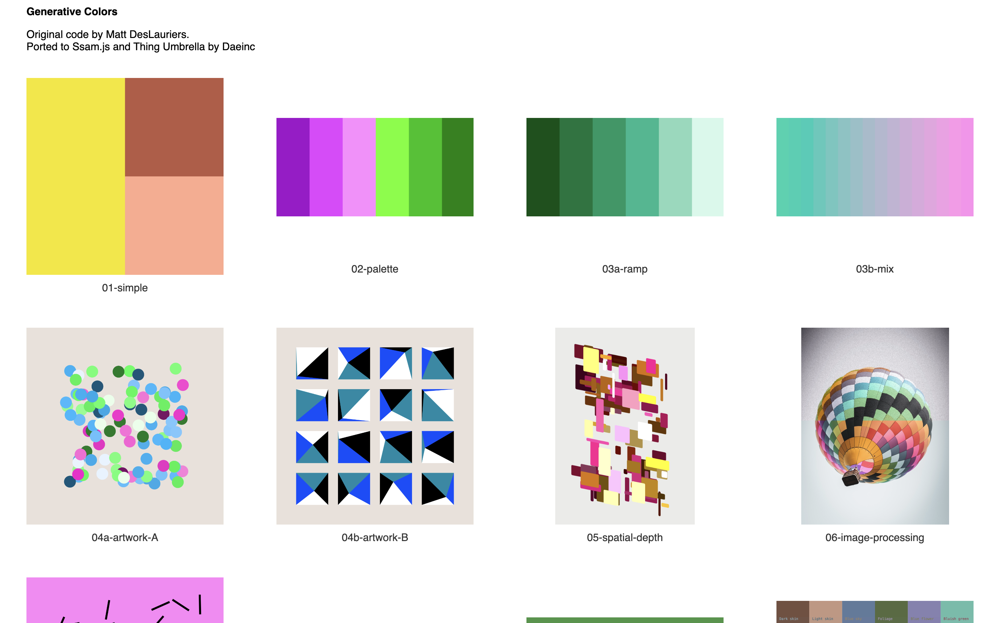

# ssam-thing-gencolor-workshop

[The original code](https://github.com/mattdesl/workshop-generative-color) is ported to use [Ssam](https://github.com/cdaein/ssam) and [Thing Umbrella](https://github.com/thi-ng/umbrella) libraries as a learning exercise. Note: The code here is not 100% same as the original.

## How to run

1. Git clone this repo.
1. `cd` into the folder.
1. Install dependency: `npm i`
1. Run the dev server: `npm run dev`
1. Sketches are in `src/client/sketches`

## License

This repo follows the same license from the original repo by Matt DesLauriers:

All code that I have written here is licensed as MIT. Some additional notes:

- The ColorChecker data in `lib/spectra/` is from [here](https://www.rit.edu/science/munsell-color-science-lab-educational-resources), which does not explicitly give a license
- The CIE 1931 2º Standard Observer Color Matching Functions and CIE Standard Illuminants in `lib/spectra` I believe are public domain. They are sourced from [here](https://github.com/geometrian/simple-spectral) and elsewhere. If somebody finds any specific license information please let me know.
- The precomputed CIE 1931 basis BT709 spectra data in `lib/spectra` is MIT under [this repository](https://github.com/geometrian/simple-spectral)
- The vendor scripts in `lib/vendor` are all pulled from MIT licensed packages.
- The oklab conversion math in `lib/oklab.js` is from Björn Ottosson's repo [here](https://github.com/bottosson/bottosson.github.io/blob/master/misc/colorpicker/colorconversion.js) and is MIT licensed
